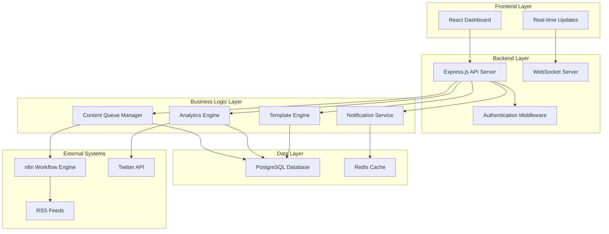

# 設計書

## 概要

インテリジェント・コンテンツ・キュレーション・ダッシュボードは、既存のn8n-tweetシステムに統合されるWebベースの管理インターフェースです。Express.jsベースのWebサーバーとReact.jsフロントエンドで構成され、PostgreSQLデータベースを共有してリアルタイムでコンテンツ管理を行います。

## アーキテクチャ

### システム構成図



### 技術スタック統合

- **フロントエンド**: React.js 18+ with Material-UI
- **バックエンド**: Express.js (既存Node.js環境に統合)
- **リアルタイム通信**: Socket.io
- **認証**: JWT + bcrypt
- **データベース**: PostgreSQL (既存データベース拡張)
- **キャッシュ**: Redis (既存Redis活用)

## コンポーネントとインターフェース

### 1. フロントエンドコンポーネント

#### ダッシュボードレイアウト
```javascript
// src/dashboard/components/DashboardLayout.jsx
const DashboardLayout = {
  components: [
    'NavigationSidebar',
    'HeaderBar',
    'MainContent',
    'NotificationPanel'
  ],
  routing: {
    '/dashboard': 'OverviewPage',
    '/dashboard/queue': 'ContentQueuePage',
    '/dashboard/analytics': 'AnalyticsPage',
    '/dashboard/settings': 'SettingsPage',
    '/dashboard/templates': 'TemplatesPage'
  }
}
```

#### 主要ページコンポーネント
- **ContentQueuePage**: 承認待ちツイート管理
- **AnalyticsPage**: パフォーマンス分析とトレンド表示
- **SettingsPage**: キーワードフィルタリングとスケジュール設定
- **TemplatesPage**: ツイートテンプレート管理

### 2. バックエンドAPIエンドポイント

#### RESTful API設計
```javascript
// API Routes Structure
const apiRoutes = {
  // 認証
  'POST /api/auth/login': 'authenticate user',
  'POST /api/auth/logout': 'logout user',
  
  // コンテンツキュー管理
  'GET /api/queue/pending': 'get pending tweets',
  'POST /api/queue/:id/approve': 'approve tweet',
  'POST /api/queue/:id/reject': 'reject tweet',
  'PUT /api/queue/:id/edit': 'edit tweet content',
  
  // 分析データ
  'GET /api/analytics/performance': 'get tweet performance data',
  'GET /api/analytics/trends': 'get trending topics',
  'GET /api/analytics/engagement': 'get engagement metrics',
  
  // 設定管理
  'GET /api/settings/keywords': 'get keyword filters',
  'POST /api/settings/keywords': 'add keyword filter',
  'PUT /api/settings/keywords/:id': 'update keyword filter',
  'DELETE /api/settings/keywords/:id': 'delete keyword filter',
  'GET /api/settings/schedule': 'get posting schedule',
  'PUT /api/settings/schedule': 'update posting schedule',
  
  // テンプレート管理
  'GET /api/templates': 'get tweet templates',
  'POST /api/templates': 'create tweet template',
  'PUT /api/templates/:id': 'update tweet template',
  'DELETE /api/templates/:id': 'delete tweet template',
  
  // システム監視
  'GET /api/system/health': 'get system health status',
  'GET /api/system/logs': 'get system logs',
  'GET /api/system/metrics': 'get performance metrics'
}
```

### 3. データベーススキーマ拡張

#### 新規テーブル設計
```sql
-- コンテンツキューテーブル
CREATE TABLE content_queue (
    id SERIAL PRIMARY KEY,
    content TEXT NOT NULL,
    source_url VARCHAR(500),
    source_title VARCHAR(200),
    status VARCHAR(20) DEFAULT 'pending', -- pending, approved, rejected, posted
    relevance_score DECIMAL(3,2),
    created_at TIMESTAMP DEFAULT CURRENT_TIMESTAMP,
    approved_at TIMESTAMP,
    approved_by VARCHAR(100),
    rejection_reason TEXT,
    scheduled_for TIMESTAMP
);

-- ツイートパフォーマンステーブル
CREATE TABLE tweet_performance (
    id SERIAL PRIMARY KEY,
    tweet_id VARCHAR(100) UNIQUE,
    content TEXT,
    posted_at TIMESTAMP,
    likes_count INTEGER DEFAULT 0,
    retweets_count INTEGER DEFAULT 0,
    replies_count INTEGER DEFAULT 0,
    impressions_count INTEGER DEFAULT 0,
    last_updated TIMESTAMP DEFAULT CURRENT_TIMESTAMP
);

-- キーワードフィルターテーブル
CREATE TABLE keyword_filters (
    id SERIAL PRIMARY KEY,
    keyword VARCHAR(100) NOT NULL,
    priority INTEGER DEFAULT 1,
    weight DECIMAL(3,2) DEFAULT 1.0,
    is_active BOOLEAN DEFAULT true,
    created_at TIMESTAMP DEFAULT CURRENT_TIMESTAMP
);

-- ツイートテンプレートテーブル
CREATE TABLE tweet_templates (
    id SERIAL PRIMARY KEY,
    name VARCHAR(100) NOT NULL,
    template TEXT NOT NULL,
    variables JSON,
    is_active BOOLEAN DEFAULT true,
    usage_count INTEGER DEFAULT 0,
    created_at TIMESTAMP DEFAULT CURRENT_TIMESTAMP
);

-- システムログテーブル
CREATE TABLE system_logs (
    id SERIAL PRIMARY KEY,
    level VARCHAR(20),
    message TEXT,
    component VARCHAR(50),
    metadata JSON,
    created_at TIMESTAMP DEFAULT CURRENT_TIMESTAMP
);
```

## データモデル

### 1. コンテンツキューモデル
```javascript
class ContentQueue {
  constructor(data) {
    this.id = data.id;
    this.content = data.content;
    this.sourceUrl = data.source_url;
    this.sourceTitle = data.source_title;
    this.status = data.status;
    this.relevanceScore = data.relevance_score;
    this.createdAt = data.created_at;
    this.approvedAt = data.approved_at;
    this.approvedBy = data.approved_by;
    this.rejectionReason = data.rejection_reason;
    this.scheduledFor = data.scheduled_for;
  }

  approve(userId) {
    this.status = 'approved';
    this.approvedAt = new Date();
    this.approvedBy = userId;
  }

  reject(reason) {
    this.status = 'rejected';
    this.rejectionReason = reason;
  }
}
```

### 2. 分析データモデル
```javascript
class TweetAnalytics {
  constructor(data) {
    this.tweetId = data.tweet_id;
    this.content = data.content;
    this.postedAt = data.posted_at;
    this.metrics = {
      likes: data.likes_count,
      retweets: data.retweets_count,
      replies: data.replies_count,
      impressions: data.impressions_count
    };
  }

  calculateEngagementRate() {
    const totalEngagement = this.metrics.likes + this.metrics.retweets + this.metrics.replies;
    return this.metrics.impressions > 0 ? (totalEngagement / this.metrics.impressions) * 100 : 0;
  }
}
```

## エラーハンドリング

### 1. APIエラーレスポンス標準化
```javascript
const errorHandler = {
  validation: (errors) => ({
    status: 400,
    error: 'VALIDATION_ERROR',
    message: 'Invalid input data',
    details: errors
  }),
  
  authentication: () => ({
    status: 401,
    error: 'AUTHENTICATION_ERROR',
    message: 'Authentication required'
  }),
  
  authorization: () => ({
    status: 403,
    error: 'AUTHORIZATION_ERROR',
    message: 'Insufficient permissions'
  }),
  
  notFound: (resource) => ({
    status: 404,
    error: 'NOT_FOUND',
    message: `${resource} not found`
  }),
  
  serverError: (error) => ({
    status: 500,
    error: 'INTERNAL_SERVER_ERROR',
    message: 'An unexpected error occurred',
    details: process.env.NODE_ENV === 'development' ? error.stack : undefined
  })
};
```

### 2. フロントエンドエラーハンドリング
```javascript
const ErrorBoundary = {
  catchErrors: [
    'NetworkError',
    'AuthenticationError',
    'ValidationError'
  ],
  
  fallbackUI: {
    NetworkError: 'ConnectionErrorComponent',
    AuthenticationError: 'LoginPromptComponent',
    ValidationError: 'ValidationErrorComponent'
  }
};
```

## テスト戦略

### 1. バックエンドテスト
- **単体テスト**: Jest + Supertest でAPI エンドポイント
- **統合テスト**: データベース操作とn8n連携
- **パフォーマンステスト**: 大量データ処理とレスポンス時間
- **セキュリティテスト**: 認証・認可とSQLインジェクション対策

### 2. フロントエンドテスト
- **コンポーネントテスト**: React Testing Library
- **E2Eテスト**: Cypress でユーザーフロー
- **アクセシビリティテスト**: axe-core
- **パフォーマンステスト**: Lighthouse CI

### 3. テストカバレッジ目標
- バックエンド: 90%以上
- フロントエンド: 85%以上
- E2Eテスト: 主要ユーザーフロー100%カバー