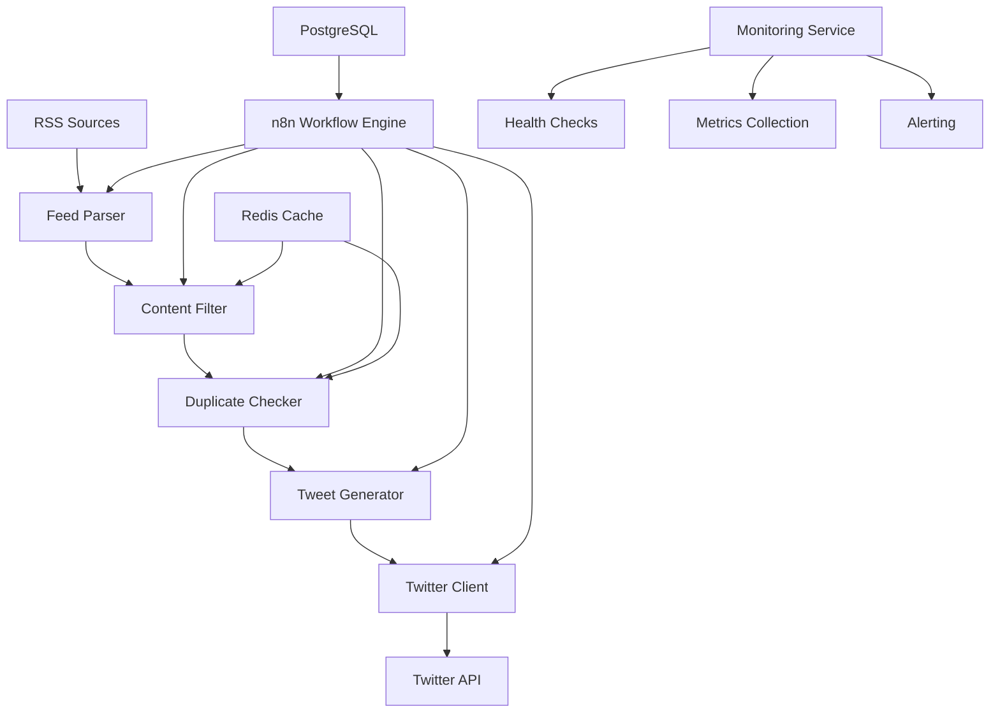

# Design Document

## Overview

The n8n-tweet system is designed as a microservices architecture using Docker Compose, with n8n as the workflow orchestration engine and Node.js services for specialized processing. The system follows a modular design pattern with clear separation of concerns.

## Architecture



## Components and Interfaces

### Core Services

#### n8n Workflow Engine
- **Purpose**: Orchestrates the entire automation pipeline
- **Technology**: n8n v1.100.1+
- **Database**: PostgreSQL for workflow persistence
- **Interface**: REST API and webhook endpoints

#### Feed Parser Service
- **Location**: `src/utils/feed-parser.js`
- **Purpose**: RSS feed collection and parsing
- **Dependencies**: rss-parser, axios
- **Interface**: 
  ```javascript
  class FeedParser {
    async parseFeed(feedUrl)
    async parseMultipleFeeds(feedUrls)
  }
  ```

#### Content Filter Service
- **Location**: `src/filters/content-filter.js`
- **Purpose**: AI relevance scoring and quality assessment
- **Dependencies**: Redis for caching
- **Interface**:
  ```javascript
  class ContentFilter {
    async scoreRelevance(article)
    async filterByQuality(articles)
  }
  ```

#### Tweet Generator Service
- **Location**: `src/generators/tweet-generator.js`
- **Purpose**: Tweet creation and optimization
- **Dependencies**: lodash, moment
- **Interface**:
  ```javascript
  class TweetGenerator {
    async generateTweet(article)
    async optimizeLength(content)
  }
  ```

#### Twitter Client Service
- **Location**: `src/integrations/twitter-client.js`
- **Purpose**: Twitter API integration
- **Dependencies**: twitter-api-v2
- **Interface**:
  ```javascript
  class TwitterClient {
    async postTweet(content)
    async checkRateLimit()
  }
  ```

### Supporting Services

#### Cache Service
- **Technology**: Redis
- **Purpose**: Performance optimization and duplicate detection
- **TTL**: Configurable per content type

#### Backup Service
- **Location**: `src/services/backup-service.js`
- **Purpose**: Automated workflow backup/restore
- **Storage**: Local filesystem with rotation

#### Monitoring Service
- **Location**: `src/monitoring/`
- **Purpose**: Health checks, metrics, and alerting
- **Logging**: Winston with structured JSON logs

## Data Models

### Article Model
```javascript
{
  id: String,
  title: String,
  description: String,
  url: String,
  publishedDate: Date,
  source: String,
  relevanceScore: Number,
  processed: Boolean,
  tweetId: String
}
```

### Tweet Model
```javascript
{
  id: String,
  content: String,
  articleId: String,
  postedAt: Date,
  twitterId: String,
  metrics: {
    likes: Number,
    retweets: Number,
    replies: Number
  }
}
```

### Configuration Model
```javascript
{
  rssFeeds: Array,
  keywords: Array,
  tweetTemplates: Array,
  apiKeys: Object,
  thresholds: Object
}
```

## Error Handling

### Strategy
- **Graceful Degradation**: System continues operating when non-critical components fail
- **Retry Logic**: Exponential backoff for transient failures
- **Circuit Breaker**: Prevent cascade failures
- **Structured Logging**: All errors logged with context

### Error Types
1. **RSS Feed Errors**: Network timeouts, invalid feeds
2. **API Errors**: Twitter rate limits, authentication failures
3. **Processing Errors**: Content parsing, filtering failures
4. **System Errors**: Database connectivity, service unavailability

## Testing Strategy

### Test Pyramid
- **Unit Tests**: 85%+ coverage requirement
- **Integration Tests**: API endpoints and service interactions
- **Performance Tests**: Load testing for RSS processing
- **Security Tests**: API key validation and input sanitization

### Test Tools
- **Framework**: Jest with TDD approach
- **Mocking**: External API dependencies
- **Coverage**: Istanbul for coverage reporting
- **CI/CD**: Automated testing on commits

### Test Structure
```
tests/
├── unit/           # Component-level tests
├── integration/    # Service interaction tests
├── performance/    # Load and stress tests
└── security/       # Security validation tests
```